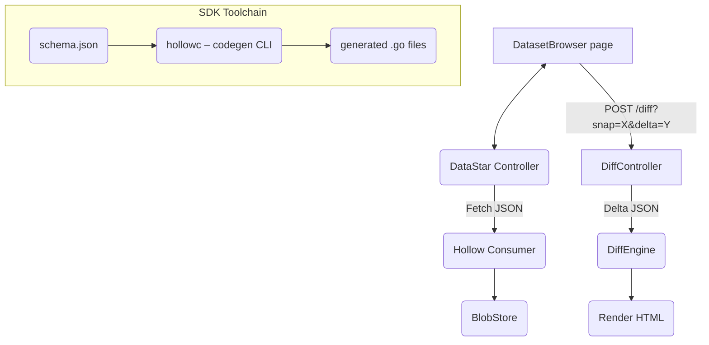

# Hollow-Go – UI & SDK PRD

> **Scope**: Adds the missing pieces deliberately omitted from the core port: **(1) Web UI (dataset browser + diff‑viewer), (2) Diff‑UI engine, (3) Code‑generation of strongly‑typed accessors (SDK)**.  All deliverables are Go‑first, browser layer powered by **DataStar** (2025.6) – an HTML‑over‑WebSockets framework similar to HTMX but Go‑native, eliminating hand‑written JS.

---

## 1  Purpose
Provide developers and operators with:

1. **Visualisation** – browse current dataset state, field‑level diffs between snapshots, and metrics dashboards.
2. **Automated SDK generation** – emit Go packages with type‑safe getters & builders from Hollow schemas.

---

## 2  Goals
| #  | Goal                                                                        | Metric                                                       |
| -- | --------------------------------------------------------------------------- | ------------------------------------------------------------ |
| G1 | Zero‑JS operator UI                                                         | 100 % interactions implemented with DataStar attributes only |
| G2 | 2‑column colourised diff at 60 FPS on 1 M‑row delta                         | <16 ms render budget on M2 MacBook                           |
| G3 | `go generate ./...` produces compilable accessor code in <150 ms per schema | End‑to‑end code‑gen runtime                                  |
| G4 | Codegen package has 100 % branch coverage in unit tests                     | `go test ./cmd/hollowc/... -cover` shows 100 %              |

---

## 3  Non‑Goals
* Mobile‑native UI – responsive layout only.
* Advanced visual diff tree‑map; future plugin.

---

## 4  System Components


* **DataStar Controllers** – Go structs annotated with `datastar:"/route"` tags.  They stream server‑rendered fragments over WebSockets.  Example snippet:

```go
// DatasetController serves snapshot tables
@route("/dataset/:id")
type DatasetController struct {
    Hollow *hollow.Consumer // injected
}

func (c *DatasetController) Get(ctx *datastar.Ctx) error {
    id := ctx.Param("id")
    snap := c.Hollow.Snapshot(id)
    return ctx.Render("dataset_view.html", snap)
}
```

* **DiffEngine** – pure Go library already ported in core project; UI calls `/diff` which returns an HTML fragment with `<tr datastar-swap="outerHTML">` lines for live updates.
* **Codegen CLI (`hollowc`)** – **lives under `cmd/hollowc/main.go`**.  It reads a schema JSON, applies `text/template` templates from `internal/templates/`, formats with `go/format`, and writes Go files to `gen/<pkg>/`.  Designed for use with `go generate`.
  * Installation: `go install ./cmd/hollowc`.
  * Usage: `hollowc -schema schema.json -pkg customer -o gen/customer`.
  * Generates:
    * `accessors.go` – typed getters (`GetLastName() string`).
    * `builder.go` – fluent builder for producer‑side tests.
    * `marshal.go` – JSON/Binary marshal helpers (SDK‑2 milestone).

---

## 5  Feature Details
### 5.1  Web UI Pages
| Page         | Route                | Description                                                              | DataStar Tricks                           |
| ------------ | -------------------- | ------------------------------------------------------------------------ | ----------------------------------------- |
| Dataset list | `/datasets`          | Table of datasets with current version, record count                     | `datastar-poll="10s"` auto refresh        |
| Dataset view | `/dataset/:id`       | Search, paginate, CSV export                                             | `datastar-vals` forms parsed server‑side  |
| Diff view    | `/diff?snap=&delta=` | 2‑pane table with additions (green) / deletions (red)                    | Virtual scrolling via `datastar-swap-oob` |
| Metrics      | `/metrics`           | Grafana‑style panels; embed server‑pushed `<canvas>` via DataStar update |                                           |

### 5.2  Diffuse Rendering Algorithm
1. Consumer computes `Diff(snap, delta)` ⇒ list of operations.
2. First 500 changes rendered immediately.
3. Remaining ops streamed as incremental fragments every `requestIdleCallback` equivalent (`datastar-idle="50"`).
4. Colour palette: `bg‑emerald‑200` for adds, `bg‑rose‑200` for deletes (tailwind).

### 5.3  SDK Code‑generation (`hollowc`)
* **CLI Flags**
  | Flag | Description | Example |
  |------|-------------|---------|
  | `-schema` | Path to schema JSON | `-schema schema.json` |
  | `-pkg`    | Target Go package name | `-pkg customer` |
  | `-o`      | Output directory (default `./gen`) | `-o gen/customer` |
* **Generated Layout**
  ```
  gen/
    customer/
      accessors.go
      builder.go
      marshal.go
  ```
* **Template Variables**: `.Name`, `.Fields` where `Fields` maps `string→GoType`.
* **Extensibility**: Additional templates discovered at runtime via `-tmplDir` flag in SDK‑3.

---

## 6  Milestones
| M#    | Deliverable                    | Acceptance Criteria                          |
| ----- | ------------------------------ | -------------------------------------------- |
| UI‑1  | DataStar router + layout shell | `/datasets` returns 200 & empty table        |
| UI‑2  | Live dataset list              | new dataset appears within 10 s of creation  |
| UI‑3  | Diff view (basic)              | can render & colourise <10 K delta correctly |
| UI‑4  | Diff view (virtual scroll)     | smooth scroll p95 <4 ms frame                |
| SDK‑1 | `hollowc` prototype            | compiles generated code for sample schema    |
| SDK‑2 | Builder & marshal              | round‑trip encode/decode ≤1 µs per record    |
| SDK‑3 | Fuzz & coverage                | 100 % branch coverage, 0 OSS‑fuzz reports    |

---

## 7  Testing Strategy
* **UI**: `chromedp` headless tests; DataStar swap semantics validated by DOM assertions.
* **Accessibility**: Pa11y CI step ensures WCAG AA compliance.
* **SDK (`hollowc`)**:
  1. Table‑driven unit tests for template rendering.
  2. Golden‑file comparison of generated code.
  3. Property‑based tests using `gopter` to fuzz schema variations.
  4. `go vet`, `go test -race`, and `staticcheck` in CI.

---

## 8  Deployment
* UI binary `hollow‑ui` served behind nginx; assets embedded via `embed.FS`.
* CSP headers strict; no inline JS (DataStar uses declarative `hx-ws`‑like attributes only).
* Feature‑flags via `go-feature-flag`.
* **hollowc** distributed as `go install` self‑contained binary – no external runtime deps.

---

## 9  Open Questions
1. Should diff view support cell‑level diff (string granularity) or row only?
2. How to expose codegen CLI via REST for polyglot languages – future?
3. Need SSE fallback for DataStar if WebSockets blocked?

---

*End of document – ready for implementation planning.*

