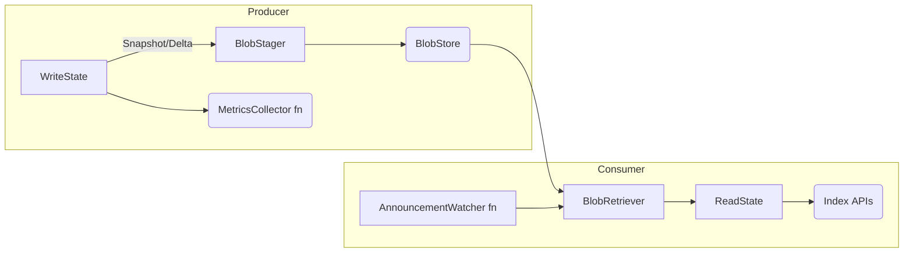

# Hollow‑Go – Product Requirements Document

## Purpose
Re‑implement the core Hollow producer/consumer libraries in idiomatic Go so that Go services can embed ultra‑fast, read‑only in‑memory datasets that are synchronised by snapshots and deltas.

## Goals
* Feature‑parity with Hollow v7.x producer & consumer APIs
* Zero external dependencies beyond the Go std‑lib; optional adapters for S3/GCS.
* ≤ 5 µs  p99 read for primitive look‑ups on a 1 M‑record dataset (on x86_64).
* Hot‑reload support using file‑watchers for local dev.
* Pluggable metrics collectors mirroring Java interfaces

## Non‑Goals
* The UI tooling and diff‑UI are **out of scope**.
* Code‑generation of strongly‑typed accessors is postponed to a follow‑up milestone.

## Architecture Overview


* Every box is a Go interface; concrete implementations live under `internal/…` for composition not inheritance.
* Logging: `slog.Logger` injected via options.
* Concurrency: producer writes hold a `sync.RWMutex`; consumer refreshes use `atomic.Pointer` swap, matching Hollow’s “double‑snapshot” trick.

## Public API Sketch
```go
type Producer struct{ ... } // NewProducer(opts ...ProducerOpt) *Producer
type Consumer struct{ ... } // NewConsumer(opts ...ConsumerOpt) *Consumer
type WriteState interface{ Add(v any) error }
type AnnouncementWatcher func() (version uint64, ok bool, err error)
```

## Milestones
| M#  | Deliverable                          | Notes                                      |
|-----|--------------------------------------|--------------------------------------------|
| M1  | In‑mem blob store + snapshot writer  | reference impl to unblock tests             |
| M2  | Consumer & refresh loop              | with TestHollowConsumer parity             |
| M3  | S3 blob adapter                      | uses `net/http` + presigned URLs           |
| M4  | Metrics & slog hooks                 | parity with `HollowMetricsCollectorTests` |
| M5  | Diff/diagnostics                     | minimal diff algorithm port                |

## Testing Strategy
* **Unit**: pure Go structs, `testing` + table‑driven cases.
* **Integration**: spin up an in‑process HTTP blob‑server and run producer/consumer end‑to‑end.
* **Generative**: fuzz the snapshot/delta diff to guarantee idempotence.

## Go Test Catalogue

### Producer life‑cycle
```go
func TestProducerRunsSnapshotCycle(t *testing.T) {
    blob := memblob.New()
    logger := slog.New(slog.NewTextHandler(io.Discard, nil))

    p := hollow.NewProducer(
        hollow.WithBlobStager(blob),
        hollow.WithLogger(logger),
    )

    v, err := p.RunCycle(func(ws hollow.WriteState) error {
        return ws.Add(1)
    })
    if err != nil {
        t.Fatalf("cycle failed: %v", err)
    }
    if v == 0 {
        t.Fatal("expected non‑zero version")
    }
}
```

### Consumer refresh
```go
func TestConsumerRefreshToVersion(t *testing.T) {
    blob := memblob.New()
    prod := hollow.NewProducer(hollow.WithBlobStager(blob))
    want, _ := prod.RunCycle(func(ws hollow.WriteState) error { return ws.Add("x") })

    cons := hollow.NewConsumer(
        hollow.WithBlobRetriever(blob),
        hollow.WithAnnouncementWatcher(func() (uint64, bool, error) { return want, true, nil }),
    )
    if err := cons.Refresh(); err != nil { t.Fatal(err) }
    if got := cons.CurrentVersion(); got != want {
        t.Fatalf("got version %d, want %d", got, want)
    }
}
```

### Metrics hook
```go
func TestMetricsCollectorInvoked(t *testing.T) {
    collected := false
    collFn := func(m hollow.Metrics) { collected = true }

    blob := memblob.New()
    p := hollow.NewProducer(
        hollow.WithBlobStager(blob),
        hollow.WithMetricsCollector(collFn),
    )
    _, _ = p.RunCycle(func(ws hollow.WriteState) error { return ws.Add(7) })

    if !collected {
        t.Fatal("metrics not collected")
    }
}
```

### Diff engine invariants
```go
func FuzzDiffIsIdempotent(f *testing.F) {
    f.Add([]byte("hello"))
    f.Fuzz(func(t *testing.T, b []byte) {
        diff := hollow.Diff(b, b)
        if !diff.IsEmpty() {
            t.Fatalf("expected empty diff")
        }
    })
}
```

